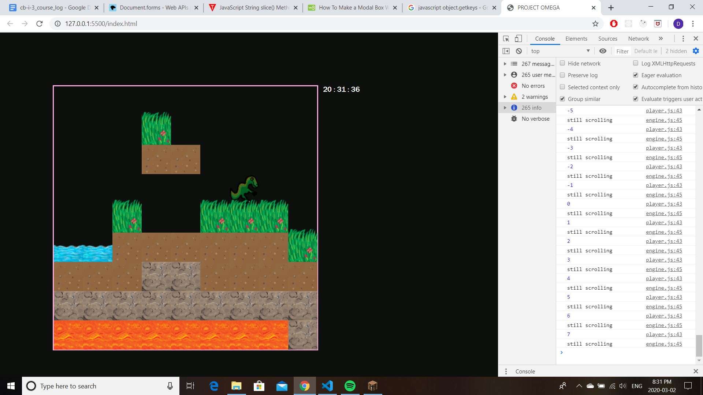
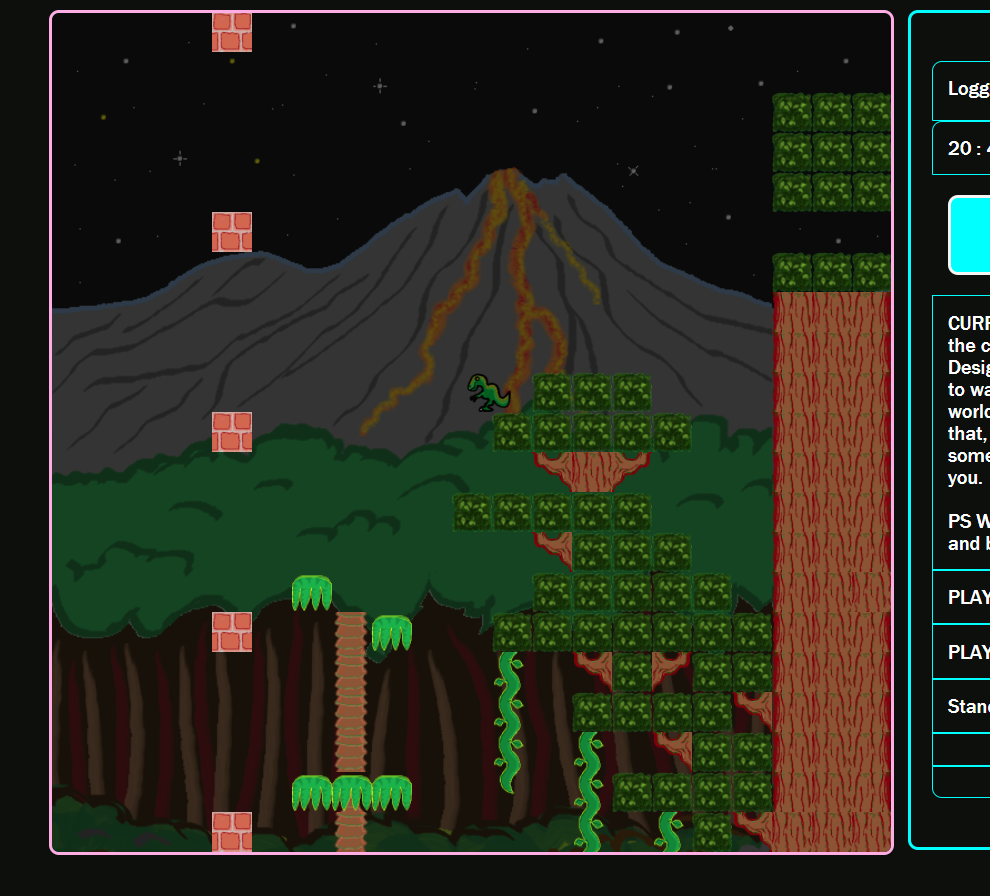
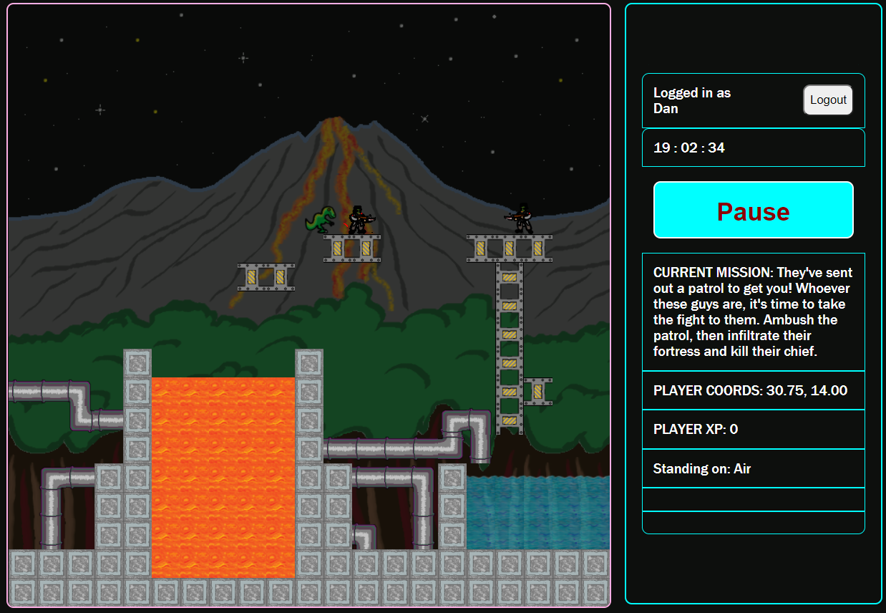

# In the Beginning there was nothing...

---

## Then there was the world!

---

# PHASE ONE: Creating the World

In the initial setup phase, I want to be able to run a function that will populate an onscreen grid with tiles, then have a player character tile that can be moved around using the arrow keys.

## Then came the lengthy list of to-do items, uncommented when they're completed:

## Incremental Change Log:

1. Render one block, at the middle of the screen.

2. Render 4 more blocks in a row at the top of the screen.

3. Create block object class, in a separate file. And move all .js files to scripts folder.

4. Test block object class by making a block with it.

5. Update block maker function so that it is limited by the world's x-dimension when adding new blocks to a row.

6. Add dimensions to the world as global variables.

7. I really want the world to be a square at the middle, rather than a line at the top. Let's change the original block-maker function, so it can be assigned start and stop coordinates that are 'out in the world' instead of being stuck at the top...
   Success! It even remembered where the world ended and dropped to the next row at the appropriate spot!

---

8. Now I think we've just about perfected the basic block maker function. Time to upgrade it to the Block Printer, which will take parameters which define a shape, and call the block maker function to make this shape. We'll start with... a rectangle!

9. At Lauren's request, also added block classes somewhat ahead of schedule. A little bit clunky now with the block functions as they are, so it's high time to consolidate the block maker function into one module.

10. Create a Player Class: Start by just rendering the player to the world in a given location.

11. Add player method to enable movement when called by game engine button handling function.

12. Add button handling function in game engine that calls player movement method.

13. Add button listener and test it out!

14. Save the Project in version 0.1 file to safeguard all this progress against future tampering!

---

# PHASE TWO: The Laws of Motion

In phase two time will be introduced, in order to regulate motion. The CSS grid setup that was initially used to render the blocks on the screen will be abandoned in favour of a 'pseudo-grid' like the cats game had. Blocks don't move so their positions can be given in grid-like intervals so their render function won't change much, but the player avatar will be able to move about the world smoothly, with position changing according to inputs from the arrow keys. The ultimate goal of this phase will be to allow the player to move and jump around on top of the terrain and be restricted by the presence of blocks - you can jump over a single block but a wall of 2 or more blocks in height is an impassable obstacle. For the moment, the player's avatar will always come to rest in an exact 'pseudogrid' position, but the movement between spaces will be smooth and can be controlled by the transition speed setting in CSS.

## Incremental Goals:

1. Time to add a timer! We'll just borrow the real time for now and keep track of it off to the side somewhere...

2. Speaking of off to the side, let's add a sidebar along the right side of the page to keep track of stuff like the time (and a lot of other things eventually if we're lucky).

3. Get off the grid! Replace the current grid display with a more fluid frame of reference that MIMICS the grid in terms of simple block deployment, but leaves open the possibility of the player moving around in a more fluid manner. Start by remaking the blocks' render function and corresponding constructor attributes to comply with the new way, brother.

4. Using the block locations array to keep track of where the player can and can't go: in the game engine, have the player's movement handler function query the blocks array to establish whether the user is next to a block in the direction they're asking to move. The pseudo-grid rules governing the player's movement should make this fairly easy.

5. To save on memory, or get some kind of gravity boost, re-arrange blocks array into an object containing an attribute representing each column, in the form on an array: e.g. {Col A: [1,2,3], Col B: [2,3,4], ... } Thus each column can have a name which is the x-value, and each block within only needs to provide its y coordinate as proof that a particular 'cell' is occupied.

6. Gravity. Make it so that, if the column you're in doesn't contain a block in the cell below you, you move into that cell. This might involve a game time loop...
   ... It works! You can even jump up if it's just one tile, although it's a little bit clunky.

---

# PHASE THREE: The End of the Beginning

In Phase Three I focused on tidying up the rules that govern (basic) movement, and also expanding the world beyond the borders of the display screen. This involved creating a new Columns object class to keep track of the individual blocks more easily, and to control the rendering/derendering of blocks as the player moves away from them, allowing the screen to follow the player as they traverse the world. Except for the starting screen, blocks are actually only generated when the player approaches them, and are then kept in the Column object's memory if the player leaves and then returns to them.

In this phase I also reorganized the game's file locations, made the game engine into its own object class, and added an intro/press any key (where's the any key??) screen so that the player can choose when to start. Minor improvements to the game's artwork were also incorporated in this stage. After this phase is complete it will be a matter of deciding what aspects to add next. The Top 3 condending options at this point are: Adding baddies, fighting, and the concept of death; improving and experimenting with the game's "physics", or introducing inventories/basic world manipulation. To add spice, these concepts will be developed in tandem with the game's level structure, with each successive feature having a 'level' built around it as a tutorial/to showcase the new feature.

## Incremental Goals:

1. Create Engine object class and rearrange the game's code to use it.

2. Have game wait on player action to start.

3. Make intro text object that loads before the game is visible and goes away when the any key is pressed.

4. Added new artwork with the help of Atack Artwork & Design Studios, who have their own graphics tablet:

---

5. If the player moves to within a certain distance of the edge in either direction, several things must happen simultaneously:
   A: All blocks in the farthest distant column are de-rendered;
   B: Everything in the world shifts away from the direction the player moved in:

- There is a horizontal offset value in the game engine
- All blocks' rendering calculations include the horizontal offset, and blocks have a method to toggle their dom elements
- The player's dom element is also offset horizontally, so your sprite is shifted away from the edge as the screen 'follows' you.
- C: A new column is generated in front of the player, OR if the player is revisiting territory they moved away from, that column is re-rendered using the above-mentioned block dom toggle method.
- D: Introduced new Columns object class to store blocks and make de/rendering them easier.
- E: Columns object is called into existence as an attribute of the game engine.

6. Physics tweaks: You can't use the move right or move left methods more than once per game cycle and jumping makes you move up by 2 now instead of 1 since the game cycle is much faster. Better physics are on the to-do list for the near future.

7. Reassign world width global variable name to the width of the wider world, and reassign all values currently associated with that variable to 'screen width' since the world and the screen are no longer the same width.

8. Make the Columns object and the Engine (if applicable) use the new global world width variable in determining how many columns to generate.

9. Re-impose movement limitations on the player's movement and/or the screen scroll method so that both stop when you get to the edge of the wider world.

10. Crudely make some kind of level out of all this and make a mission for the player to touch both of the edges of the world. A console log message of congratulations is then proudly displayed!

---

11. Save this stage and get to work on some actual homework!

# PHASE FOUR (AKA Version 0.1): The Mission object and the World Builder Suite

In the first true stage beyond the game's initial setting up (phases one through three were essentially just one long march to the start line) I will introduce some pre-packaged environments for the player to run through, using more than just 2 of the 5 lovely tiles now at my disposal. There will be two types of things made here:
A) customized pre-built 'biomes' that span approximately a dozen or so tiles and that are completely pre-ordained (we'll store the column templates as lists of one-digit numbers and save a fortune on memory!) and
B) A 'smarter' Block printer that can remember what the previous column looked like and base the next one on that, so that even the non-pre-fabricated landscape is more interesting and also blends with itself a bit more smoothly.
Also featured in this stage will be a few more tile types in order to further expand the world's visual diversity, and in the anticipation of more interesting terrain properties to be introduced in the near future...
Lastly, since tidiness is the highest virtue, I will clean up the hastily added 'levels and objectives' stuff into something tidier and more attractive, and also try to expand the concept somehow, perhaps by adding some kind of little in-game 'Level Up' animation or a sidebar with messages... We'll see!

1. Create 'Biomes' library, and make one array of arrays which will serve as the blueprints for our first 'biome': each array represents one grid, and the numbers refer to different block types.

2. Alter Block Printer function to no longer take height argument; instead it will take an array of 'layers;' a list of block types to be placed, from the bottom up, to render the column.

3. NOTE TO SELF: Always build new functions that are replacing a previous function BESIDE their obsolete ancestors - not INSIDE them while they're still ostensibly 'live.' Transitions are much less alarming this way. Or at least, somewhat less alarming.

4. Finally make it so that you face the direction of your movement. Edit: Wow! Good old CSS... never thought I'd say that!

5. Make 3 new block types.

6. Draw, and then implement 3 more hand-crafted biomes.

---

7. Make it so that, as the screen scrolls, the block column object's block printer method builds a biome instead of a lone column when it is called.

8. Tidy up all of the level-making stuff into something cleaner and then remove all the console log signs except the one congratulating you for visiting the east/wester 'poles'. Also, add one for each separate pole so you can see your progress!

9. Make objective objects and mission objects, then use them to replace the mission objectives/level up features previously attained.

10. Standardize the start/end heights of the biomes, then make a randomizer feature in the biome printing method so it doesn't repeat the same terrain endlessly. Also make one more biome for variety.

11. Save current progress as version 0.1. We're restarting our version counts here, and the reason why is... to Create a repo on Github and learn the ropes of that system!!

---

# PHASE FIVE (AKA Version 0.2): Dynamic Blocks and Better Physics!

Phase Five will see the incorporation of three key features: 1. Blocks that have various properties such as permeability and climbability, 2. Basic physics to make jumping, sinking(!) and general movement more fluid and less grid-like (we got off the grid but we didn't get very far!) and finally... 3. LETHALITY! This will lead us to finally develop the concept of the player's death, which in its initial stages will be immediate and thus will require the introduction of a 'restart' button in the game, and everything else that your death would require in terms of re-running/resetting things. The player's death will be hard to implement but not radically complicated since it's just a matter of finding what needs to be reset; the dynamic blocks interaction will require some more out-of-the-box thinking since we'll have to modify the columns' WayClear function to test the blocks for their attributes instead of simply seeing if there's something in the way of the intended direction of movement. For the physics, let's start by seeing if we can refine the collision detection system to work when the player is between exact grid spaces, and go from there. Towards the end of this phase a few 'missions' of discovery will be added and the missions/sidebar area will be jazzed up so you no longer need to use the console/browser tools to see your mission objectives.

1. Terrain detection: First, just have a console log statement telling you which kind of block you're standing on top of/ trying to move into.

2. Make a distinction in the blocks for solidity, so the way clear function lets you pass into blocks that aren't solid.

3. Then, introduce a gameOn variable for the engine; the engine only runs if this is set to true, which it will be when you press the any key. NOTE: This can also be connected to other events in the game than you dying; finishing a mission or just pausing the action are all offshoots of this.

4. Connect the two previous features: if you walk on a tile of a certain type (let's say lava AKA type 4) you 'perish' and the game stops. I E connect the way ahead's tile-type output to the game shutdown mechanism.

5. Start introducing the idea of changes over time; lava kills you but it doesn't do so immediately, and you should still sink a little bit before you die... turns out that this is more than just a casual addition of a new feature... Major re-thinking is now in order:

6. The Way Clear function: currently spits out a 1-2 part array containing a boolean and an optional number... very messy. Convert that into just one value - the number zero for 'clear' and just the block type number if not. Sadly this will mean reversing any conditions that depend on its output since right now the return 'true' means clear, whereas the new version will return 'false' if the way is clear, as in 'no obstruction.' Will rename to isWayBlocked to keep labeling conventions as readable as possible.

7. Re-tooled the physics engine to work on impulse rather than grid value snapping. Still looks about as clunky and I'm sure more than a few bugs have crept in and not yet been squashed. Removed 'move(direction)' middlemen functions for player movement and condensed that into a button handler which gives impulse, and an impulse movement method which runs every cycle: does collision checks and updates player's coordinates accordingly.

8. Alter movement (x/y coordinate updates) so that impulse plays more of a role than just being a timer - e.g. you move faster when your impulse is high and slower as it tails off. Now that we're truly off the grid\* for the player's movement it is finally possible to use some basic algebra to make the movement functions far more smooth - and interesting... And fucking complicated it turns out!

9. Completed some more significant overhauls to the physics system, which now includes both horizontal and vertical obstruction checks (each its own method) plus one method for handling the outcome of movement requests (sent from the keyboard handler) and the blockage checks. It is still possible to fall through a corner but that seems easily solvable after what we've just been through!

10. Expand collision-detection to include:

11. The block you are currently in? (for air and water)

12. The block you are currently standing on.

13. The edges of the world.

14. The corners!!

15. Isolate Collision Detection AND Impulse Mover into their own modules (painful but oh so necessary for the future of the project).

16. The above step might also be a good time to pave the way for removing a lot of the player's physical/movement-related attributes into a parent 'Physics' class, for when the time comes to add some other creatures to the world (or thrown objects, or anything else at all ultimately).

17. Have variables for: Friction: Air, Land and Ice... Water we'll do later when there are some 'deeper' water tiles to play with.

18. Once the engine is running as we like, it's time to get back to the fun stuff: level-building and missions!

19. Re-add death: If you stand on lava, you die instantly, meaning the game freezes, text is displayed announcing your death, and the a restart button appears... Hitting the restart button will set the player's x and y coordinates to zero, turn off horizontal offset, remove all player XP, shift the screen back to its original position and unpause the game. Prior to hitting reset button, the pause button should have no effect...

20. Alter Biome Builder to accept wider biomes, then make 3 - 4 of those.

21. Create 2 missions (we can keep the visiting of the sides, although it might be a bit of a case of the journey to the side being the 'level' that makes that entertaining.)

22. Add some flair to the mission module, i.e. message text for when you complete a mission that ISN'T in the console log, and see if there are some nice CSS animations for gaining XP or leveling up or whatever.

23. Background image/s!!!

---

24. Make 2 more levels that push the horizon of the Columns object's ability to add and remove columns:

25. Extend the original world farther as a level instructions/mission setup:

- Add New Mission, Level 2, that contains setup instructions to widen the world: "add-columns", [ [column start number (rightwards), column end number], [column start (leftwards), column end] ]
- Add new case to engine's mission setup method for 'add-columns'

26. The final level's setup wipes and stores the original world and renders a completely new world: BaconLand!

27. Upload Version 0.2 to Github before the corona virus kills us all!!!!

# PHASE SIX (AKA Version 0.3):

Phase Five, while it saw the introduction of several key features, was far too ambitious for a single stage, and should really have been made in two or even three version increments. Phase six will restrict itself to just one purpose: Setting up the game on a server. This will of course require the installation of a whole host of dependencies to make the server run, and once it is up the game's UI will, if we're successful, not be any different at all. To cap this stage off and make some visual improvements, we will take advantage of the addition of a package.json file to upgrade our CSS file/s to SCSS and use this to add some fun visual effects for the mission change transitions... Hello Good Vibrations!

1. Use NPM to setup a basic package.json file, and fill in the answers to all its various questions.

2. Create a server.js file, and leave it empty for now.

3. Install the various dependencies for our server by npm installing express, morgan, concurrently and nodemon, and setting up the server.js file as the 'entry point' to the program. This will consolidate the newly added scss compilation process, and also hopefully let people play this game on the local network!

4. Rearrange the game's file folder structure and place the original game files in the (newly added) public folder.

5. Configure the server to run on port 8080, and see if we can reach the game via the server.

6. Have the game ping the server and the server reply with 'hello.'

7. Have the game ping the server and the server reply with the current time.

8. Have the game ping the server when you reach BaconLand, and have the server acknowledge by sending a short message that includes the time and the name of the level (echoed from the game).

9. Create a new page, the Login Screen, that the user accesses before playing the game.

10. The Server must know who the current user is.

11. Make the server check, upon the user's arrival, whether they are signed in, and direct them to the sign-in page if they aren't.

12. Add list of [user/password] combinations to the server's database area, so that when you create an account you can access it later.

13. Hook up the signin page's input fields so that when you submit a name/pw for an existing user, server checks if the given userid and password match; if so it sends you to the game page; if not, it asks you to provide the correct password or register a new username if it doesn't recognize the name.

14. Make one dummy username/pw combo and try it out by sending that combo from the signin page.

15. Allow new users to enter a name/pw and submit that to the server; if the name isn't taken the server adds it to its database and lets them proceed; if not, the user is asked to either sign in with that name, or create a new username.

16. Add function in the game's code to toggle server dependency.

17. Art Department: Player XP display and Mission statement area glow briefly when new level loads.

18. Finishing touches: Rumble effect for level 2 (world widening)

19. Code Cleanup Extraordinaire: Introduced Blocktionary file to simplify addition of new blocks and their features. Modified Block object class template to take block data from here instead of being directly hard-coded.

20. Re-add lava lethality in accordance with the new Blocktionary principles (tinker with Engine slightly, methinks?)

# PHASE SEVEN (AKA Version 0.4): Say Hello to the Bad Guys!

I have just one word for you, just one word: Baddies...

And now for several more words on that happy subject! Bad guys will of course be the first non-player entities to be brought into existence which makes their presence on the map quite unprecedented. We'll have to do this in stages, starting with the creation of an Enemy object class. Next step will be to render an actual bad guy, initially as though he were a motionless version of the player. Next we'll do some movement tests where the baddy is ordered to move around on the screen over a given range of columns, and verify that this works with all our existing physics (i.e. he only appears when you walk up to him and does not do anything else). Then for the hard part: wiring up a physics module to control a baddie's movements, and give him a movement script of some sort to test the physics engine's handling of a (non-player) entity. Theoretically it should be no different than controlling the player's sprite but with simulated key-strokes/movement requests instead of real ones, but who knows what will happen! Once all of this is figured out and the bastard moves we can think about killing him/having him kill the player, but let's not get ahead of ourselves just yet!

Start by drawing one Draw.io chart of the villain's interaction with the existing systems in this world, to refresh your memory of your own creation and seriously contemplate the entirety of this relation from initial rendering to death/murder.

## Phase 7.I: Render unto Caesar

1. Alter the Engine's instance of the physics system to name it 'playerPhysics', as there will be other entities who need to use physics.

2. Setup Enemy object class. Be sure to include a 'movement script' attribute so it can be programmed later on. 'Territory' as well.

3. Add 'Handle Baddie Renders' method to the Engine; run it right after checkScreenScroll method in the game's loop.

4. Add this.enemies array to the Engine.

5. On initialization, tell the engine to add one Baddie to its enemies array, with a location just off the screen.

6. Test if the 'scan for baddies' method pings. If so, use it to render the enemy in the appropriate spot, and to horizontally translate its DOM element appropriately. Once this works Phase I is complete.

## Phase 7.II: Move damn you, MOVE!

7. Add CSS rules to baddies - consider the difference between them 'snapping' to a translated position and their regular 'motion' - maybe this is the reason for initial jerkiness? Addendum: Yes, it is! So we'll definitely have 2 classes of baddie motion here so they snap when they need to snap, and transition when they 'move.' Remember: All CSS is now in the SCSS file.

8. Add start/end values to enemy's 'territory' and a movement method for them to move back and forth within this range.

9. Movement rules should be carried out regardless of whether a baddie is rendered (x position is still measured even if there is no DOM element to manipulate), with the upshot that they will occasionally move into your view even if you're not moving.

10. Create flat test-site 'provingGround' biome to test rudimentary baddie motion.

## Phase 7.III: Fall damn you, FALL!

11. Read through the physics module and abstract out anything that ties it specifically to the player so it is a neutral set of rules for motion for any sprite.

12. Bad guys currently move by jumping from grid location to grid location. We need them to request speed whenever the patrol action fires, like the arrow keys request motion for the player (speed is actually set immediately and then collisions are verified then movement is authorized).

13. Added a rule where bad guys only have physics applied to them if they're rendered, to stop them falling into the bottomless hole that exists before the blocks are rendered.

## Phase 7.IV: Jump damn you, JUMP!

14. Add 'jump' method to baddie class.

15. Detect if baddie is obstructed by terrain.

16. If a baddie is obstructed by terrain, have them jump.

## Phase 7.V: Kill damn you... KILL!!!

17. Create Collisions Object. It will keep track of the distance between moving objects and their angles to each other.

18. Make this new system ping if you approach an enemy unit to within 1 square on either the X or Y axis.

19. Second challenge: make it tell you the direction from which you approached an enemy (what end of you faced what end of them)

20. The player has a 'determineIfDead' method which is invoked every cycle by the engine. This checks for whether the tile you're on has the 'lethal' property, and if you've had a collision with a baddie. Either results in death.

21. Change range calculation to use pythagorean distance instead of basic x or y range to make for closer encounters!!

# PHASE EIGHT: BASIC COMBAT! (AKA Version 0.5)

Since baddies have been added there is mounting excitement about the prospect of sharing/hosting this game! Before we are ready for that however, there is just one few loose end to tie up: Adding the ability for you, the player, to fight back against your new adversaries and kill them in a satisfying way.

1. Create combat-checks dictionary with outcomes for different angles of approach and distances tailored to each baddie.

2. Hook this up to the direction-checking function in collisions object.

3. Run basic tests (approaching baddies from different angles to see what pings).

4. Add baddie death method to their class, and have engine filter and remove dead baddies with each cycle.

5. Add player attack method and attack cooldown method (run by the engine each cycle) to allow you to fight back!

6. Add simple attack animation to display player's striking distance; play this whenever the attack method is used.

7. Using the strike distance animation as a guideline, fine-tune the kill/be-killed distance values for our two baddies so they are nice and specific.

8. Once these have been tested out, create an animation sequence for baddie deaths. Use GIFs to add some spice to the proceedings.

9. Add baddie 'isDying' property to allow baddie sprites to persist while we watch them die without posing a hazard to the player.

10. Take the range bracket out of the Baddictionary and move it to the player's (specific) attack method for the range checks; call the value that positions the attack's DOM element 'attack range' and store the numeric value of your attack's strike radius as 'attack radius.'

# PHASE NINE: DEPLOYMENT!!! (Version 1.0)

WE ARE LIVE! Currently the program is once again a Front-End only application (no server-side functionality) which is pretty A-okay as it lets people experience the game and only loses login process (which was really more of an experimental proof-of-concept exercise than a 'must-have' feature anyway). Next step is to thicken out the game a little bit in terms of content before announcing to the world that the product is ready for play-testing! Specifically this means adding more baddies/bringing them into the mission structure of the game, making bigger biomes, and tightening up the CSS rules to ensure a playable experience, at least for people on laptops of any screen size. Essential at the end of this stage of development will also be some kind of procedure for managing version/source control so the code history (and documentation) are kept safe and regularly pushed to.

NOTE: Suspended server-related code is commented out in index.html, main.js, and constants.js which also contains the server function toggle switch.

1. Update pathing in server.js file to point to the public folder so we can once again run the game!

2. Create a Firebase Repo to host the Front-End (in essence, the entire game as it currently stands).

3. Incorporate baddies into mission-data structure:

4. Add switch case to Engine's mission-setup reducer function.

5. Test adding baddies via mission data file instead of at engine constructor line.

6. Refactor player death sequence and eliminate attack animation if it is playing when player dies.

7. Adjust CSS rules for maximum page height; test with smaller window sizes.

8. Make 2 larger biomes for the initial world (can be partial amalgams of other biomes to save time).

9. Redeploy that #\$%&! Then test on other devices and take notes for continuous improvement.

# PHASE TEN: DEPLOYING VERSION 1.1!

Following the explosive debut of the game's first public release, there was a lot of concern voiced about the game's somewhat sluggish movement-responder system, and also a demand for more and bigger content and levels. To address these demands, we must release the first in-production patch to satisfy the game's fans. To be addressed in this version: Rebuilding and refactoring the player's key-responder and movement handling functions, tweaking the baddies' patrol logic (no more getting stuck under trees!) and designing and creating two new biomes with a couple of newly crafted blocks to add diversity, and longer and more interesting missions to drive further exploration.

1. Reprogram baddies' patrol method to turn back when trapped under foliage/when an impassable obstacle is reached.

2. Refactor player movement responders to alter an isMoving boolean variable and thus handle movement more indirectly, so that a keydown and keyup responder function system can be used to allow multiple keys to be held down simultaneously without cancelling each others' effects.

3. Refactor player movement methods to abstract out the movement action from the keyboard responder switch blocks.

4. Add player crouch method for the often-neglected DownArrow/S-Key press (purely aesthetic function for now is fine).

5. Add WASD controls alongside the arrow keys (now you can use both! nothing at all dangerous about that!)

6. Create new blocks for pipes (vertical, horizontal and corner cases) and passable fences.

7. Design and then digitize Fortress biome.

8. Design and then digitize Tree-fort biome.

9. Add baddies-killed counter to Engine.

10. Add baddies-killed-this-inning counter to engine and player so we can subtract its value from total kills if you die (at which point baddies will respawn). This value is reset whenever a new mission starts, or whenever the player dies.

11. Add Respawn-baddies method to Engine to bring back dead baddies for the current level when the player dies: this will actually clear all baddies from the field and then re-run the current mission's 'add baddies' level setup call.

12. Create Nazi Scientist sprite.

13. Create mission for Tree-fort level that involves killing all baddies which then then removes a wall, allowing entry to the Fortress level.

14. Create mission for Fortress level that involves fighting the Nazi scientist and winning the game.

15. Create GIF for scientist death.

16. Ensure scientist death animation has the same size-formatting rules as his regular image.

17. Change player width and block width variables in SCSS and game constants file and alter the screen size to 'zoom out' and show more terrain on the screen!

# PHASE ELEVEN: DEVOPS Code Reorganization (Version 1.2)

This is a purely organizational change which will involve only tiny alterations to the game's code base, with new additional gameplay or feature changes. The idea is to separate the Development and Production environments so that Dev can continue to push changes to the game's official code to GitHub while the production environment has its own separate connection to Firebase. During this phase the game will add several DevOps techniques to the game's philosophy, including separate Dev/Prod environments, more use of variables from the game's Constants file to be incorporated in lieu of hard-coded values elsewhere, and more procedural documentation! Also, the game's server functionality will be resurrected for the Dev mode, mostly so it can convert SCSS files into CSS. And because we can.

1. Use DevOps philosophy to reconnect to Git: Clone the existing remote repo, then copy over the contents of the Public folder from the currently hosted (latest) version into the cloned directory. Rename the directory that contains the Firebase repo to 'BlockLand-Production' and name the newly cloned directory to 'BlockLand-Development.'

2. Next, ensure the CSS rules in the Dev folder are updated by importing the CSS from the production environment into the Development folder's SCSS file - it will overwrite the CSS file in public every time we run the dev server so it's crucial to always use the SCSS again now that all changes will be conducted in the Dev environment.

3. Re-activate the server, then test that the game works smoothly in dev mode.

4. Do a massive git push to get all of the latest progress saved on the remote repository.

5. Create a short procedural how-to for updating BlockLand now that we're CICD!

6. Write all changes in game functionality that are based on Dev vs Prod environment (i.e. anything to do with 'server functionality') to automatically toggle themselves based on a single 'DEV_MODE' boolean in the game's Constants.js file, for easier migration of code from development to production environment.

7. Once the new documentation is satisfactory, git push it immediately, merge the pull request, and open a new branch: Version 1.2.

8. On this new branch begin coding the next features: Vertical Scrolling!

# PHASE TWELVE: VERTICAL SCROLLING (Version 1.2.1)

There is just one very simple objective to this version bump: add vertical scrolling to the game's list of features, and make one or two levels which show it off! Vertical scrolling should allow the screen to follow the player above the game's original cieling and below the original floor, and be fully compatible with the existing horizontal scroll feature.

1. Give the engine a 'vertical screen scroll distance' variable.

2. Create a new engine method: 'checkVerticalScroll'.

3. Make another engine variable, 'SCREEN_HEIGHT_IN_BLOCKS' for the height of the screen, in block height terms (screen height divided by block width).

4. Make the new vertical scroll method run every game cycle and report when the player's Y value is within the screen scroll distance of the top or bottom of the screen (use the new constants' variable).

5. Add engine property: vertical offset.

6. When the vertical screen scroll function pings, increase/decrease vertical offset.

7. Next, for the Block class definition, add a 'vertical displace' method, that causes its DOM element to appear higher or lower than its Y position would indicate. This will let us show blocks that are above or below the screen's initial position.

8. For the Columns class definition, add a 'vertically displace column' method, which calls the vertical displace method of all the blocks in a given column.

9. Have the engine's CheckVerticalScroll method use the Columns object's visibility range to determine which columns to offset when the player approaches the roof of the world; print the following variables to the console: Player Y, Visibility range, vertical offset.

10. Try to hook up all the pieces and RUN THAT FUNCTION!

11. Not bad, not bad, just forgot to shift the PLAYER and we should be good...

12. Also the baddies. Mustn't forget to move them as well. Then we should be OK.

13. Make a new biome to test this functionality for moving upwards.

14. In a fit of design, expanded the SCREEN's dimensions to take up much more of the actual screen space. This was done with SCSS variables but the games JS still ultimately requires that the screen's dimensions be hard-coded into the game's constants in order for everything to work... In a later patch it will be necessary to research Webpack, which allegedly lets Javascript read SCSS and thus use its variables (this would be a big breakthrough in the game's screen responsivity - a major consideration in production).

15. The expansion to the world has revealed some ancient bugs in the code, in particular hard-coded values in the game's mission setup scripts for rendering new terrain that require a very precise screen size. Replaced these with references to the Constants file, and also made Constants the first script imported in the index.html.

16. Play through the game with your QA hat to see what still looks/feels out of place before proceeding (we might be okay, but check anyway).

17. Allow player jumping method to go above the original screen height.

18. Alter Physics module to allow movement beyond original screen height.

19. Make sure blocks render/de-render properly when vertical offset changes (hint, this requires solving the problem and then ensuring that the horizontal rendering method doesn't override the solution!)

20. In the Columns class, add a method specifically for toggling the visibility of blocks based on their height (defining top and bottom of screen as render area).

21. Make baddies' rendering conditional on vertical as well as horizontal offset.

22. Fix it so baddies are hidden if they're to appear on the initial screen.

23. As for downward movement, for the moment it must not be allowed; reduce the vertical screen scroll distance to 3 and make each map a minimum of 3 blocks tall, to prevent scrolling into negative Y territory impossible.

24. Make Test Stage biome for quickly testing new blocks' graphic elements in a variety of patterns.

25. Make a cool new level (biome and mission) with some new block types to really explore the vertical space!

26. Play this level extensively. For quality control, of course.

27. Reorganize biomes file by level and clear out all older biomes to basic biomes folder.

28. Spruce up the Fortress biome just a bit. And elevate it where necessary. Then reposition guys (they've all been elevated by 3 in advance).

29. Squash that bug that pops up at the end of the game.

30. Merge Master branch into BlockLand-1.2.1 branch then create a new one for version 1.2.2. Keep Version 1.2.1 branch head so it points permanently to that commit.

# PHASE THIRTEEN: Baddie Class Attacks and Lava Bubbles (Version 1.2.2)

Although the public is clamouring for the release of the latest patch, certain features of the game must be polished up and/or completed before the next Big Release. Specifically, the Boss baddie must become its own class, complete with separate logic for its electric attack (although perversely the attack logic itself will go to the more general Baddie Class - a warmup for a much more significant refactoring that is yet to come). The Collisions Class/badDictionary module will be updated in the wake of the advent of baddie attacks, to ensure satisfactory outcomes of more advanced combat encounters. Also, a special 'lava-surface' block will become

1. Examine Player Class attack functionality: animation, countdown, and how it fits into the collision detector.

2. Clone player attack animation functionality into baddie class, and give baddie class necessary attributes to be able to attack in general - attackRadius, attackAnimation, attackCooldown, etc.

3. Create Boss Subclass of Baddie class.

4. Create Engine Level setup switch case for handling the creation of Bosses.

5. Remove boss cosmetics and special sixth argument from baddie constructor function and bring that into the Boss class.

6. Use this to bring the Boss into an early level to test this new functionality.

7. Give Boss subclass a method for counting down and performing attacks. Make the countdown part of the Boss's patrol method.

8. Create electric attack GIF.

9. In the Collisions module's determineFacing method, add baddie's attack radius to the encounter calculations.

10. In the Collisions module's baddie dictionary, change the boss's lethal radius to be smaller. Also rename that property (it's actually currently 'killRadius') to 'dangerZone' to reduce confusion with the baddie (and player... soon to be 'sprite'?!) class's attackRadius attribute, which is now being used in this module.

11. Add 'gif' to Block Class's special properties array options, to enable block to look for .gif file instead of usual .png.

12. Create bubbling lava surface GIF.

13. Create flowing magma GIF.

14. Replace existing lava blocks with GIF animations. Give 'gif' property to both, and give 'permeable' trait to lava surface block.

15. Make new 'opaque' trait, to be considered last, in Block attribute switch case. To be paired with permeable to override the transparency effect.

16. Fighting back against level-chirality rigidity: add flowing-right, -left, -up and -down properties as variations on the 'flowing lava' block template, and use CSS rules to render lava flow in the appropriate direction.

17. Update README file before launching latest version.

18. Go through deployment checklist and put version 1.2.2 into PRODUCTION!

### Version 1.2.3: CODE CLEANUP PHASE 1 :O

Sometimes you have to do some housework before you can expand to bigger, awesomer things. This project is in dire need of some code cleanup and best-practice retrofitting. Better get a decorator in here because... DAMN. For Cleanup phase 1 the focus will be on refactoring all of the worldly game classes to subclass the new Entity and Sprite classes. Entity will be the most general, and Blocks and Sprites are descended from it. The Player and Baddie classes will subclass Sprite, and Boss (and also Flying Baddie - the reward for sticking it through this whole rigamarole) will subclass Baddie.

1. Create Entity Class.

2. Make Block Class subclass Entity, and adjust its Constructor and the Columns biome-building method to fit this new disposition.

3. Abstract out the attributes in the Entity class shared by the Player and Baddies classes, then determine what attributes a sprite should have that stationary objects like blocks can't (hint: movement, attack-related statuses).

4. Create Sprite subclass of Entity. Abstract out as many attributes that are common to the Player and Baddie class to it.

5. Create abstract Entity-level rendering control method. Use the block class's toggleRender method as inspiration, but split it into two functions rather than a single toggle function. Test this new system's implementation with the Block class, and good luck integrating it with the Engine's Screen scroll method... Success! The Block Class now has NO methods of its own.

6. Abstract out horizontal and vertical translation methods from the Player and Baddie Classes into Sprite class.

7. Investigate Baddie's de/rendering method to see if it has been made redundant by the Entity Class's version. If so, replace it with the appropriate new version in the Engine. If partially, have it call the Entity Class's render/deRender functions to condense the method's code blocks.

8. Abstract out Attack sequence control methods from Player and Baddie into Sprite Class.

9. Complete the transition by straightening out the following values: Attack position = (Rightwards: Your position + your width), (Leftwards: Your position - attack animation width).

10. Initial Refactoring is now complete. Try to keep it tidy, and after the next feature is added we'll take a look at the Engine and see if we can extract some stuff to some helper functions!

### Version 1.3.0: The In-Game Menu

As fun as it is to develop more content, sometimes you need to take care of logistical stuff first. The game's interface is barely evolved from the Nyan Cats game, and this is something that should be addressed before any further work on the game's Engine cycle. We need to develop the capability to do stuff outside the game cycle, both before and after the game has started. The game's menu will be rendered by the Main script before the Engine cycle starts, and contain options to visit the instructions page, a few dummy buttons, and Start New Game, which starts the Engine. Once in-game, the sidebar will have a button for the menu, and we will remove the mission briefing from the sidebar. The in-game menu will enable navigation to pages showing your current mission info (briefing, list of objectives) as well as some dummy options for later use.

This process actually involves quite a bit of refactoring, since we're aiming to remove all of the HTML elements from the index file and have them all be created by scripts instead. So gradual steps and extremely frequent git commits are the order of the day (as should always be the case).

1. Create Draw.io diagram of what the Main Menu will look like, and answer some basic questions on its design and workflow.

2. Create the App Class. It will be created by the main script, and have methods for rendering the game's various UIs - chiefly the World as we know it AKA the realm of the game's Engine - but also the various menu screens. Add it to the index.html's scripts list, right at the top of the Class-containing files.

3. For every element in the existing HTML file, do the following:

   - Comment it out from the index file
   - In Constants.js change the const to a let, and refer to a null
   - Add the creation of that element (create, assign class/id, addchild, assign to constants variable) to the App's renderGame method

4. Add a line to the Engine's renderBaddies method (it's not actually a method on its own just yet but it should and someday will be) to assign the proper 'world' to each baddie as they get made.

5. Give the App Class a startGame method, which calls the renderWorld and renderSidebar methods, and creates the Engine.

6. In Main.js, create the App and remove the creation of the Engine.

7. Go through the other major class files and update their references to Thomas.

8. Rearrange existing global variables with HTML element references to be part of a single dictionary-like object. Modifying them through this object works with the App Class's current render methods so let's go for it!

9. Ensure any existing references to deprecated global elements now go through the global elements dictionary. This is a bandaid solution.

10. Remove all references to the deprecated world element from mission_data (which is to say, for all baddie instruction lists). Since this shortens the arrays for those entities, see following instruction on how to replace them:

11. Use unshift instead of element replacement in the Engine's render-baddies methods. Use similar logic for special FX cues.

12. Removed all deprecated global element variables from constants, and html elements from the index and played through the game again to hunt down existing references to them. Also removed all constant references from renderElement/renderButton's argument lists.

13. Make Class components for Elements!

14. Make Class components for Buttons!

15. Make Text Class like the Element objects i.e. add a render/derender method to them... In fact, are they a Subclass of the Element Class?? Think about it. You have selected... No.

16. Give the App Class a method for rendering the pre-game menu: Create and add all the elements that comprise the Menu. One of the elements created will be a button which, when pressed, calls the startGame method, which will have included in it the command to de-render the pre-game menu (see next item), then

17. Give the App Class a method for de-rendering the pre-game menu: Removes all the elements that comprise it. Ensure that the elements are removed in the opposite order than they were rendered, so children are always taken out before parents. Suck on that, Theoden.

18. Consolidate the Engine start sequence commands into another App method, then call that in from the Main script.

19. Rewrite Main.js script to have the App render the pre-game menu before going to the game.

20. Give the creation/cleanup of event listeners linked to button elements to the App class. Currently just dumping them in the start sequence is acceptable, but we should consider their removal for when they're not wanted.

21. Remove the initial globalElements entirely - they are not needed anymore and will only complicate things going forward. Eliminate them then do a thorough playthrough test to ensure they aren't missed.

22. Create buttons for showing the game's background story and instructions screen.

23. Add SCSS styling rules for Main Menu buttons.

24. Create App render functions for the backstory and instructions screens.

25. Make a Return to Main Menu button handler function that unrenders the current UI and renders the Main Menu.

26. For each of the Backstory and Instructions screens, incorporate the Back to Main Menu button.

27. Create some basic text for the instructions page and background story.

28. Remove the 'intro' CSS class as the default for Text elements; decide which ones in the game to assign that class to specifically. Otherwise the main menu's just a little TOO shiny.

29. Make the in-game text fully opaque again. Try to remember how you did it that other time, and document the solution this time!

30. Add a Button, In-Game Menu, to the game's Sidebar.

31. Create new App method for rendering the IN-GAME menu, which can use the same format as the pre-game menu (shared SCSS classes) but contains a different set of buttons: Save (dummy), Load (dummy) and Settings (also initially dummy). Be sure to include a 'back to game' button!

32. Make a function that pauses the game, de-renders everything in the world, and then renders the in-game menu.

33. Ensure that all buttons/sidebar display widgets have their roots updated too (bring back the restart button!)

34. Remove Mission Text from the Sidebar; eliminate references to it in the game code.

35. In the In-game menu, add code to check the engine's current objectives and objectives achieved parameters and display them as text elements.

36. Abstract out the hard-coded links to the HTML elements themselves from the various Classes which update something on the Sidebar (Player Position, Standing-in, etc.) and have all updates of these elements controlled by an Engine update function. Consider adding a try/catch block to the timeout function that removes the special effects (since there can be confusion if you enter the menu while special effects are playing).

37. Add SCSS rule for objective-achieved text elements that crosses out objectives you've achieved in the menu screen.

38. Add dummy buttons for Save, Load, and Settings in the in-game menu.

39. Expand Mission module's try/catch capabilities to prevent errors with entering the menu while mission statement display/special FX criteria are in flux.

40. Have entering the menu have the same effect as hitting the pause button vis-a-vis acting as keyup events for movement responders.

41. Have entering the menu cancel attack animations for the player and baddies, by adding the attack animation to the updateRoot Entity Method.

42. Commit and push these changes into production.

## Version 1.3.1: Hit Points

At long last the time has come to make the Player, as well as some of the tougher Enemies, a bit more durable. In this patch the aim will be to add HP for all Sprites, introduce damage into the combat collisions calculator, and display the Player's HP in the Sidebar. Death will no longer necessarily be an automatic outcome of being hit, but will result when a Sprite's HP fall to (or below) zero. Additionally, being hit should produce a knockback effect as well as temporary (1 - 2 frames) invulnerability for the Player so that they don't lose several HP for a single encounter.

Recovering HP and augmenting the max HP for the Player will be the subject of future patches that introduce items and the RPG progression tree, respectively.

1. Add currentHP and maxHP properties to Sprite class, with a default value of 1 for each. Also add hitpoints argument to constructor function.

2. Give the Player 3 HP to start the game with.

3. Give each specific attack (Claws, electricity) a damage value, in the form of of yet another Sprite property: currentAttackDamage.

4. For the Sprite, Player and Baddie Classes, change all references to 'collisionStatus' property to 'damageRecieved' property, and change the value from a string to an integer.

5. Update the Collisions module to take an attack's damage value and pass that onto the victim's damageRecieved property.

6. For the Player and Baddie classes, make their collision-status check mechanism subtract damageRecieved from current hitpoints; if the result is equal to or less than zero, then make them die. As soon as the subtraction is complete reset damageRecieved to zero.

7. Remove the playerMedium Sidebar element from the App and Engine.

8. Create a new Sidebar element to display the Player's HP.

9. Have the Engine's updateSidebarDisplays method check the Player's HP and adjust the display accordingly.

10. Add a Sprite knockback method that is called if they are hit but not killed (this method should also grant momentary invulnerability).

11. Add a 'current attack knockback' value to all specific attacks which is passed to the knockback method to determine how much force a particular attack throws people with. Remember that the universe has a terminal velocity of 1 at the moment!

12. Make baddies get hit by knockback from your attacks, too!

13. Update the loucanphile of the HP display element. Ahh, that's better!

14. Push to production!

## Version 1.3.2: Items

From Mario's mushroom to the Sword of Plus Five Agility, all great games have iconic items that the player can pick up. Blockland will start with some basic 'powerup' items which will be placed in the game by the Engine based on instructions from the mission data library. These initial items will grant an instantaneous effect for the Player when they are 'picked up' (when the player moves over them) such as adding health or XP. A slightly more sophisticated form of this 'powerup' item concept will then be attempted with an item which bestows a temporary increase to the player's speed. Jetpacks and Uzis will be introduced in a later patch for 'advanced' items.

1. Create Item subclass of Entity with the following properties: affects (which stat it affects), power (how much of it affects you), and duration, which will be how many game frames you keep the effect (0 means the effect is instantaneous). Also add an item type for the DOM element's look.

2. Add the Item script to the game's Index.html.

3. Create 3 Item images and add them to the game's assets, in a new folder called Items.

4. REFACTORING TIME!!! Change the Mission data to object/dictionary form instead of all those arrays! We can keep the setup instructions as an array for now.

5. Add a new type of level setup instruction to the mission data files: Item placements. Data needed: x, y, type.

6. Add new Engine property: currentItems.

7. Add another level setup case to the Engine's setup method, for adding Items to a level. Will resemble the 'add one Block' case.

8. Add a CSS class for items to make their position absolute, and also to control their render size. Other options to follow, perhaps.

9. Add an Engine method for checking each frame if any items have been 'picked up' by the Player. Test by having the Player walk up to an item and console logging that fact.

10. Expand the pickupItem function to Derender the item in question, and remove it from the Engine's currentItems list.

11. Create a Player method with a switch case to determine what to do with an Item that has been picked up. The Engine's itemUpdate cycle will call this method in lieu of logging to the console. Note: Since this method will pivot on the item's 'type' it will probably not be necessary to provide the 'affects' attribute since it's contained in the type (and even better, the type/switch case will make it easier for Advanced Items to affect multiple stats.)

12. Item effects for Health: Check if Player is below Max HP; restore up to (the lesser of): the value of the item or maxHP.

13. Item effects for EXP: Simply add the value to the Player's current XP.

14. Item effects for Steroids: Add the item's power to the player's jump impulse and top speed properties; reduce them after (item duration) frames of gameplay (so a duration of 20 = 1 second).

15. Ensure that Player's item-induced special attributes are removed upon death.

16. Ensure that Items are regenerated by the Engine in the event of the game having to restart.

17. Ensure that Items are removed from the game by a mission setup instructions/engine reducer effect.

18. Ensure that Items are re-rendered after the game's Menu is closed.

19. Analyze what should be done (if anything) to ensure that new game content can be added more easily without having to individually perform these last 2 steps (are we talking unit tests? a 'new features' checklist describing where to put things in the Engine?)

20. Modify the wetlands biome to serve as an introduction to the Items, and have it include getting a very long-lasting dose of the steroids and they're introduced at a moment where you just need to make a big jump to keep going in that moment. Keep the heart on the opposite side of the first baddie (the one on the block over the lava). Cumulatively, this will serve as an introduction to the Items and Hitpoint features. Lastly, add some XP Items to both ends of the map when the 'touch both walls' objective is met. That way, at the end of the course you can have the Player get some experience, which he can spend in our next big feature, which is coming very soon now...

21. Update README file to reflect current progress and priorities.

22. Push to production and close the branch!

## Version 1.3.3: RPG Character Development

At last the time has come to use the Player's XP! The in-game menu will be modified to host the character development screen, which will be like a tech web which the Player gradually fills out. At the center of the tech web will be the 'basic dinosaur' node, and the initial attributes that the Player can buy branch outwards from there. The Player will gain a new perk every time they level up, which will cost progressively more experience each time. Since the game advances based on mission progression instead of character experience accrual, the Player's experience/level development must be able to revert to lower values/levels if the player dies (much as the Baddies-killed-this-inning counter does). In terms of game UI, the Player's experience display in the sidebar should be replaced with a bar, much like the HP display, which fills up as you progress towards the next levelup. When you achieve a level up, this bar should display the text 'level up: select perk' and it and the menu should glow to indicate that the user should engage with them.

1. Remove dummy buttons from in-game menu. Set visibility to 'None' on player coords, standing-on displays in the App, and comment out the Engine's update function for these components.

2. Add Player Level attribute (number).

3. Add Player Perks attribute (list).

4. Add Player requiredXP attribute (number, representing how much experience is needed for your next levelup).

5. Add Player previousLevelXP attribute (number representing the amount of XP needed for your current level).

6. Add Player ExperienceGainedThisInning attribute (number, which will be subtracted from your total XP if you die).

7. Add Player LevelsGainedThisInning attribute (number, which will reduce your level if you die).

8. Add Experience Bar component/s to the App's renderSidebar function.

9. Add Engine method to check the Player's XP each frame, and update the Sidebar's XP bar display (text for starters).

10. Create dictionary file for different perks. Perks have attributes: name (unique string), attributeAffected (string name of Player/Sprite attribute), value (number by which that attribute is affected), and prerequisites (list of names [unique string id's] of other perks).

11. Create new SkillTreeNode component, which creates a Span-within-a-Div as its DOM Elements. Each element should have a unique ID based on the ID of the instance of the class e.g. 'attack-1-container', 'attack-1-text.'

12. Create CSS rules for SkillTreeNode class (which is what these new components will be by default).

13. Create CSS rules for Skill-Tree div (parent div of all these prospective skill tree Node elements).

14. Create a new Class, SkillTree, which has the Skill Tree div as its main DOM element. This will act as a management component for the skill tree, much like the Columns class manages the blocks/terrain.

15. Give the SkillTree fields for storing the following information: A) Array of skills the Player has already taken, B) Array of which skills are currently available for purchase (costs don't factor in here as the Player is simply awarded one new skill per levelup), C) Array of skills which cannot yet be purchased.

16. Give the SkillTree class a method for rendering all of the nodes in the tree (take from the experimental code sections in the App itself).

17. Give the SkillTree class a method for de-rendering all of its nodes as a cleanup when the menu is closed.

18. In the App, make a method that creates a SkillTree class instance.

19. Add a new field to the SkillTreeNodes: status (whether the skill has been 'purchased' by the player, 'available' to be purchased, or 'unavailable' to be purchased). We'll add a CSS class to change the node's appearance based on this status. Default status is 'available.'

20. Either make the Skill Tree Node Container elements into buttons, or if possible, add an onClick attribute to the current divs, so they can be a clickable interface.

21. Add a console.log to the code for the Nodes, so they tell you when you've clicked them.

22. In the game itself, fix the XP-awarding system to be the way we want it to be, starting by detailing all of the methods involved in the process.

23. Remove the conditional -1 XP point from the Player death handler method, and instead reduce XP by XP-gained-this-inning.

24. Make a Player gainExperience method to augment player XP and XP-gained-this-inning values. Have all experience gained conveyed through it - i.e. make the Player's own pickupItem method use it and hunt down any other events in the game which pass the player XP and make them do it by calling the gainExperience method instead of however they do it currently.

25. Make a Player checkForLevelUp method, which is called by the gainExperience method (why check for a levelup except when you're gaining XP, right?). If the Player's XP is greater or equal to the next level's threshold, add one to the player's level (and levelups this inning), inform the Player that they can choose a new perk in the game menu (via a Text object??), replace the previousLevel value with what was the nextLevel value, and increase the cost of the next promotion.

26. Make a Player experienceCheckpoint method, which the Engine will call every time a Mission is finished, and which will reset to zero both the experience and levels-gained-this-inning values so you don't lose everything when you die.

27. Add a condition to the Player's handleDeath method to reduce level by levels-gained-this-inning value, and if a reduction occurs, pop the last item off the Player's perks list... IF a perk has been taken for that level (in fact, make the pop based on whether or not the amount of perks is in sync with the amount of levels left after one is knocked off ==> (perksList.length > this.level).

28. Once this system is tested, add a prompt for the Player to choose a perk for leveling up in the game Menu (console.log is fine for now)

29. When the menu is opened, have the App pass the value of the Player's perksList.length > this.level calculation (perksAvailable attribute) to the node TREE, and have the TREE console log the number of perks that can be chosen.

30. Put all of the nodes into a single list in the SkillTree, instead of differentiating them by their current puchase status.

31. Add a Skill Tree Node method for handling being clicked: if the status is 'available', set to 'purchased'. If the status is 'unavailable', console.log a message declaring this fact. If it is already purchased, console.log THAT fact.

32. For the Skill Tree itself, make the click event handler check each of the nodes' statuses and console log them.

33. Give the Skill Tree another attribute, which will be passed as an argument to its constructor: skillsPurchased (player's perksList).

34. Give the Skill Tree Nodes a boolean flag, to be toggled when they're 'just purchased'

35. Use this flag in the Skill Tree's node status check; if it's just been bought, then reduce the amount of available currency for purchasing.

36. Make the Tree update its children to make all but the ones already purchased 'unavailable' when the skillsAvailable value reaches zero.

37. Update the renderSkillTree method to use the data from the skillsAvailable and skillsPurchased fields, such that each skill from the perks list is mapped by a loop, and its status is set according to the following logic: If the skillsPurchased list includes that skill, set its status to 'purchased', and if there is at least one skill point, set all the other skills to 'available.' If the number of skillAvailable points is zero, set all non-purchased skills to 'unavailable.'

38. Have the SkillTree keep track of which skills have been acquired since it was opened (the skill delta, if you will).

39. Once this logic is tested, make a new method for the Player, gainSkill, which adds the bonus from any newly aqcuired skills to the Player's stats. This method would be called by the App, and would be called once for each newly acquired skill.

40. Then, make a removeSkill method which pops skills from the skillsList until they match the Player's level. For each skill removed, subtract its bonus from the appropriate attribute.

41. Develop COMPREHENSIVE test cases for this system, and perform them. Add any issues uncovered to this feature's checklist.

42. For multi-level drops, ensure the XP requirement for nextLevel is reduced for every level that is lost. Also ensure that the skillsAvailable points are always kept in sync with the Player's level (and skillsList length) so that no combination of levelling-up/gaining skills/dying/reaching checkpoints causes a discrepancy between what you should have and what you get.

43. Draw some mockups to improve the sidebar XP display.

44. Make the XP bar inner component's length a percent of (the difference between the last level's XP threshold and the next level's threshold).

45. Add Prev and Next Levels to the bottom corners of the XP display box. Have these be updated by the Engine's sidebar element update cycle as well.

46. In the Engine, amalgamate all Sidebar display elements into an object, so that the updateSidebarRoots method can iterate through this object's keys rather than needing a separate copy of each element's identification assignment.

47. Brainstorm results for new character traits: Intelligence ( -10% XP costs ), Agility ( + 0.03125 top speed), and Grip ( friction acts 1px/cycle faster on land and ice).

48. Intelligence part 1: The Player needs an intelligence attribute.

49. Intelligence part 2: the Player's next level cost determination is influenced by this value (reduced).

50. Grip part 1: The Sprite class gets a grip (!) attribute, with an initial value of zero. Increasing this value should make you slide less before stopping when you're on the ground (ice included).

51. In the Physics module, add the subject's grip value to all land and ice friction calculations (grip doesn't affect you in the air).

52. Once all of these great improvements are done, add an experimental tooltip text caption for each skill.

53. Give the TreeNode element class a third DOM element: its tooltip text.

54. Create a styling rule for the tooltip so that it only appears when you mouse over the parent div. See if you can get the tooltip text to appear this way.

55. Prerequisites: When a node's availability is calculated, if it has prerequisites, it should only become available if all of those prerequisites have the 'purchased' status.

56. Create inter-node GIF animation.

57. Add functionality to the SkillTreeNode's constructor to render up to 4 branch nodes, and rotate the image to a specified angle around the Z-axis! (Note: current implementation is extremely crude and brittle. Suggest upgrading to something that uses trigonometry instead!)

58. Then I think we can commit and close the branch.

## Version 1.4.0: Level Editor!!!

One of the most ambitious features to be talked about for this project is the inclusion of a level-editing capacity that doesn't involve creating long lists of lists by hand for the level/terrain files. The final 'feature' developed before the holidays will attempt to undertake this process by a series of proof-of-concept exercises geared at exploiting the Node File System's ability to read, and then write files to the hard-drive. The ultimate aim of this project is to create an interface in the web browser which can be used to generate a level file by filling in a grid on-screen, therefore allowing the content creator to have a mostly visual interface, instead of a huge ugly pile of numbers. That being said, progress on this Epic must move very cautiously, starting with a very simple file output test (create a hello world file) and adding complexity from there.

1. Create a new endpoint/page for the Map Editor, so the user can go to a page that is specifically for the Map Editor (and outside the whole App structure of the actual game).

2. Create a separate directory for the Map Editor files - test inputs to be read, and output files which will eventually come to resemble the files found in the biomes files. Also contained in here will be any Scripts that are related specifically to the map editor, and a CSS file for styling the map editor page as it develops.

3. In the Map Editor page, make two buttons: Read File and Write to File.

4. Create a dummy text file that will serve as a test of the 'read file' button.

5. In the Server file, write a script that imports 'fs' from Node, and uses it in a simple fileReader function. Demo this by reading the test file describe above and logging it to the console.

6. In the Map Editor scripts file, make the readFile function perform a GET request to the server, and have the server reply with the contents of the requested file.

7. The real proof of the pudding: In the Map Editor scripts file, make the makeFile function perform a POST request to the server, which will then WRITE THE CONTENTS OF THE POST TO DISK!

8. Create a simple text input and use that to determine the filename of the file-to-be-written. Create some differently named Hello Worlds to celebrate.

9. Make a simple JavaScript file as a final preliminary proof-of-concept demo. And plug it in and walk around in it. Hoorah, phase one.

10. Add rudimentary styling to the Map Editor page, and then get down to business making some levels!

11. Final proof-of-concept exercise vis-a-vis file creation workflow: Modify the Create Map button responder to APPEND new content to an existing file (use the basic_biomes file for now).

12. Add a third component to the editor: the control panel. This will hold buttons to move the map around either vertically or horizontally, and also zoom buttons, all of which will be dummies for now.

13. Create the Editor Class, the engine of this new universe.

14. Create the Cell Class, the Blocks of the Editor.

15. Add a method to the Cell to change its type to 1 when clicked. Also make it change color by adding a css class.

16. Add an event listener to the Editor so it can listen on clicks within its area, and tell you how many tiles have been clicked as proof that it's up-to-date.

17. Add another field to the Editor: output. From the Editor's updateCells method, as cells are filled, add integers to this more minimal list, which is formatted as the biomes file expects to receive them (as integers).

18. Make a god-damn level and walk around on it right now! Addendum: the level known as hidden_smile must be kept forever as the very first level (of any interest) to be produced entirely via a graphical interface!

19. Import the Blocktionary into the Editor's html file.

20. Add a method to the Editor to render a clickable image for each block in the blocktionary, labeled with the name of the block type.

21. Add another click listener to the Editor, this time for the Palette area, to update its 'currentBlockBrush' property on whichever block type was clicked last.

22. Have the Editor change the palette value for every cell, so that its click responder 'paints' the image of that block to the cell, and registers the output to be that cell's 3-digit ID number.

23. Fix the Air/erase button on the palette. Addendum: it is still ugly but acceptable for the map editor MVP.

24. Determine which other features will be needed and then create tickets for them.

25. Enable Pan Right button:

26. Add a horizontalTranslate method to the Cell class, and have the Editor call this method (and supply an offset value) when the Pan Right button is pressed.

27. The Pan Right button should also have the effect of checking if there are more columns to the right that are not currently on-stage, and creating them if so.

28. Finally, make sure to deRender all cells that are pushed off to the left of the display area by panning right.

29. Add a render method to the cells so they can be brought back when we pan left.

30. Enable Pan left button: mirror image of the Pan Right button, EXCEPT that you should not be able to move further left than the initial screen position (restrict effect based on h-offset value - e.g. if h-offset <= 0, do nothing).

31. Add Pan Up button, modelled on Pan Right's functionality.

32. Ditto for Pan Down button; spell out in more detail if the horizontal stuff warrants it...

33. Sync up horizontal and vertical map scroll so that they play nice together.

34. Add indicators to the corners of the stage to show the height/width values on screen at a given moment.

35. Expand the control panel area in the Editor Interface. In this field we'll have options for different 'brush' sizes, as well as a button and an input field for adding a 'bedrock' layer of variable depth to the bottom of the map, using the current palette selection as the block type.

36. Add pagination buttons to the Palette.

37. Add a current block display element (span) to the palette.

38. Bedrock functionality: Link up all of the inputs in the bedrock area to the Editor Class, and have it console.log their value on change.

39. Add fields for bedrock top, bedrock bottom, bedrock height, currentBrushSize, and palettePageNumber to the Editor's initial properties list.

40. Make the Palette's updateSwatch function update the label for the current block with its name and number, and show a picture of the selected block, AND make the swatch element glow faintly green.

41. Add Bedrock function: For every column, fill cells up to (bedrock height - 1) index with the bedrock bottom block type, and fill the final index position with the bedrock top type. Hitting the button should absolutely not refresh the page, and clicking it multiple times should have no additional effect (it simply sets each column's first X cells to the specified composition). Start by making the button console log the values for top, bottom and height.

42. Now for the different 'brush' options: Start by making a simple handler function for each of the brush option buttons that stores the value of the currently selected brush option. Also, make the button element for the current selection glow like the current palette selection does.

43. Create a paintAdditionalCells function for the Editor: First step is to make the Editor state which cell was just clicked (rather than getting that from the Cell itself).

44. Now that that's out of the way, create the logic for painting additional cells, based on the coordinates of the one that was clicked + the current brush selection. PaintAdditionalCells should operate as a switch case function and be called from the updateCells method.

45. Pagination time: Initially populate the palette with only the first 64 entries in the Blocktionary. Create 6 new dummy block types to test this.

46. Paginaaation: On clicking the 'Next' button in the palette, cleanup all the existing palette options and then load items 65 - 128 from the blocktionary. Finally, make sure to increment the current palette page value.

47. Make the previous button only work if the current palette page is greater than 1.

48. Final thing for Map Editor v.1: Loading an existing biome in order to modify it. Start by adding the basic_biomes to the editor's HTML script imports section.

49. Add an input field to the Editor's 'banner' area to allow the user to input the name of a biome they wish to load. Verify that this function can recognize the biomes by console logging the length of a given biome, or saying "sorry, we couldn't find your biome" if it's not on the list.

50. If the loaded biome (which is still an array) is longer than the current width of the editor, increase the editor's width and add empty cells to fit the incoming biome.

51. For each column in the loaded map, if it is longer than the current height of the editor, increase the editor's height and add empty cells to fit the incoming biome.

52. For each column of the loaded map, paint each cell with the appropriate block type, and add the ID to the output file.

53. Adjust the map loader's empty cell generating procedure so that it populates all columns with empty cells up to the height of the tallest column, to avoid issues with empty spaces appearing in the grid due to unequal column heights with the original levels.

54. Final, FINAL thing: Make it so that hitting the 'E' key always selects Block Type zero, so you don't have to navigate back to the first page of the palette in order to Erase.

## Version 1.4.1: Adding Content!

As the year comes to a close, it's time to reflect on a job well done, and finally take advantage of the game architecture that has been created. It's a developer's dream come true right now, but unfortunately that doesn't make it super playable on its own. It's time to give the game some personality, starting by outlining the story and the first mission in detail so the content team will know what to get started on. Then the immediate focus will actually be on designing all of the specific UI improvements needed to make that first mission possible (including speech bubbles, waypoints, improvements to the game's sidebar, some GIFs, and more truthful attack animations, esp. for the player) as well as any final features of the game (such as a slide-show intro sequence, restricting the character's movement during the game's opening 'mind-controlled' sequence, and timing in-game dialogue sequences so they appear like real cartoon conversations).

1. The slideshow: Create a new Class: Slideshow, which will be created by the App when the 'Start New Game' button is clicked. Like with the other game elements, the App will render a div as the 'root' element for the Slideshow to manage, as well as a 'Skip Slideshow' button. If pressed, the Skip Slideshow button will call a Slideshow cleanup method, to ensure that no intervals are left running in the background.

2. Rewire the App so that the Start New Game button doesn't immediately create the world, but instead calls a renderSlideshow method instead. Have this method render the true Start Game button, which will read 'Skip Intro' as it is part of the intro slideshow screen now.

3. Make a library file like the Blocktionary, with info for the slides: id (num), caption (text), alt text (describing the img), duration, and whether it's the last slide in a 'scene.'

4. RenderSlide method: creates an IMG element with src=<path to asset> and attaches it to the root, then does the same for the the caption (creates a text entity??), AND THAT'S IT.

5. AdvanceSlide method: derenders the current slide, increases the currentSlide value by one, then sets the currentSlideTimeLeft attribute to the duration value of the current slide, and calls the renderSlide method... and the updateSlide method to start a new timer.

6. Start Slideshow method: Sets the value of the current slide's duration as timeRemaining, then calls the updateSlide method, which begins creating 1-second timeouts, each of which decrements the time remaining until the advanceSlide method is called.

7. Slide class in CSS is absolute position, and has a widescreen (16: 9) aspect ratio, etc... Get it looking good with the dummy slides and make sure the skip button works as advertised and causes no errors.

8. Have the Slideshow render each slide's text... AND make it scale the size of the letters based on the length of the slide's caption!

9. Make a few rough attempts at the game's actual intro slides, USING DIFFERENT LEVELS OF DETAIL TO GET DIFFERENT FILE SIZES, then when they're done, make sure everything is normal again (remove wierd test values from constants, columns and mission data) then deploy this to production to evaluate how quickly different image sizes are served from Firebase.

## Version 1.4.2: UX Enhancements - Dialogue and Thought Bubbles

The first enhancement to the game's UX prior to its big release will be the addition of speech and thought bubbles. These will be used for plot advancement, gameplay hints, and comic relief. Speech and thought bubble elements will be properties of Sprites, and be rendered to the World just like attack animations. Data for the messages and conditions for when to display them will be contained in the mission_data files, and the Engine will check every cycle if a Sprite should say or think something.

1. In the mission_data file, work out the structure of the dialogue information.

2. Expand the Mission object to store and update the dialogue info for the current level.

3. Create a new Engine method to check each cycle for the all of the conditions for the current mission's dialogues, and console log any dialogues as appropriate.

4. Add a Sprite method that the Engine calls when a dialogue occurs, so that the Sprites do the console logging.

5. Add a 'duration' to each dialogue's data, representing how long it should be shown (in game cycles).

6. Add a unique ID value to each dialogue's data, so that Sprites can keep track of which dialogues they've uttered (this will be useful to prevent repetitions of one-time dialogues, and also to control the frequency with which repeatable dialogues are re-uttered).

7. To the Sprite Class, add a new trait: an array of 'dialogues uttered' which stores the ID's of dialogues spoken.

8. When a Sprite's dialogue method is called, have it send that dialogue to the dialogues uttered list. Prevent the message from repeating if its ID is in the uttered list, unless it has repeat = true.

9. To the Sprite Class, add a trait for current dialogue, and another for currentDialogueCountdown.

10. Instead of firing every frame, make a dialogue count down to zero before considering any other dialogue cues.

11. Create a new class, Dialogue, that is a Div, a paragraph, and an image of a bubble tick (you can take it from the critter folder!)

12. The Dialogue's render function is a bit more elaborate than the standard Entity's, since it has to stick the main element (domElement) to the world, and then pin the bubble-tick to that element.

13. Create CSS classes for the dialogue and bubble-tick elements.

14. Integrate the Dialogue script to the index, and then rewire the Sprite's dialogue method to create a Dialogue entity instead of logging to the console. This entity will be stored as the Sprite's dialogue (new property).

15. Make both a createDialogue and a cleanupDialogue method for Sprites that renders/derenders their dialogue when a dialogue countdown hits zero.

16. Make the bubble-tick appear nearer to the bottom of the text bubble, make the font _slightly_ smaller, and add horizontal/vertical translation to the bubbles so they join the Sprite that uttered them.

17. Make dialogue bubble ticks and position change if their speaker is too close to the edge of the screen.

### 18. Make dialogue position respond to utterer proximity to the vertical edges as well.

19. Make the Engine clear its dialogue registry every time the mission changes.

20. Make the final boss say something, as a test that dialogue works anywhere.

### 21. Aesthetical consideration: can we make dialogues disappear non-instantaneously by adding some sort of fade-out property to them as they are de-rendered?

# Remaining Tasks for Refactoring:

### 1. Refactor Baddie creation data in mission_data file to use dictionary objects instead of arrays. Every Baddie must be updated to use the new format and the Engine's Baddie and Boss creation cases in the level setup function must be reconfigured to read dictionaries instead of objects... It will be painful but it is better this way in the long run.

### 2. Convert the rest of the Mission Data file to JSON format, and update Missions and Objectives Classes correspondingly.

### 3. Before there are too many of them, refactor the Class Components to evolve from a basic Element parent class.

### 4. Go through Engine methods and see if some of them can be abstracted out to helper files that are then called from smaller, cleaner code blocks.

### 5. For the Collisions system (And accompanying 'Baddie Dictionary') the goal should be to keep the logic tree of who-faces-whom, but abstract the code blocks within to just one or two function calls to determine: A) player attack range? B) baddie effectiveness range.

### X. In general, try to organize things around the principle of each aspect of an object's existence being handled by ONE thing - don't have many different methods involved in rendering/translating; have one meta-method that handles it all (by calling individual sub-functions, to avoid clutter). Example of how this does not currently happen: Block creation is handled entirely by the Columns Class's block printer method... Except for the blocks made by the Engine's level setup reducer method!

# BUG-HUNTERS' BOUNTY LIST:

1. You still can't jump when you're > 50% over a ledge, and now to top that off it also says you're standing on 'undefined' in the Game's Sidebar, which pretty much screams 'bug!'

2. Enemy translation/derendering is sometimes still abrupt/jerky. Fix that by adjusting baddie CSS rules/render distance rules.

3. Caught a phrasing-induced bug in the baddie dictionary for baddie type 1002 - collision type named bothFaceAway instead of backToBack, which is the standard.

4. Interdimensional portal sometimes doesn't render until a screen scroll occurs when in BaconLand. Investigate. SOLVED: Added immediate call to horizontally translate any blocks rendered individually by Engine's level-setup "Add one block" procedure.

5. New issue detected: for levels with tallness greater than the screen's height, there is a stacking image error for blocks that start rendered ABOVE the top of the initial screen (and are thus given bad cues for when to toggle their appearance afterwards). Add some logic to the blocks' initial render instructions to account for this.

### 6. Blocks created when the world renders sometimes appear just a moment before being translated to the correct position - not a terrible glitch but a bit of an eyesore... See if that can be tightened up somehow.

### 7. The Philosoraptor (intelligence-01) perk initially has no effect; it should immediately reduce the amount of XP needed for you to attain your next level (currently you have to pick it, then level up AGAIN before the XP discount kicks in).

# PHASE X - Art Department:

### 1. Touch up water and swamp-water block images to make them more transparent... OR alter the player sprite's

### 2. Vortex effect (spin and blur) for level 3 (interdimensional) and teleportation in general.

### 3. New block type: Singed - like they've been burned by time bubbles/explosions/god knows what!

### 4. Sign post blocks (alt. size rules for some block types???? Built as readable property in the Blocktionary???)

### 5. Add a new backdrop for the background story page (new SCSS rules for back-story class and App creates the element).

# Food for Future Thought/ General Notes:

### I. Attack object class: gets created when the player hits the attack button/s and is used to pass information relating to an attack to bad guys... and/or the environment?!

### II. On Scalability for smaller screens: CSS rule for body of main page layout: below a certain screen size, reposition sidebar below main game display.

### III. On touch-screen responsiveness: investigate using the document object to pinpoint the coordinates of a mouseup event; use those to trigger Player movement responder functions instead of/as complement to keyboard presses.

### IV. Firebase is pretty quick but not instantaneous when serving image files larger than roughly 500 KB. For the pre-game slideshow, we can either take this into account and serve primarily low-resolution images OR have each slide get rendered 'behind' some kind of additional obscuring layer so that the image has time to load before it is presented to the user!

Artwork Upgrades: Display new block images as tiles in the file where you work on them so you can see them side by side as you edit - in fact, why not bring them straight into the game and walk around on them while you're at it?! Cue the Test Stage.

### More/different attacks for the player? Different cooldown times, greater or shorter ranges, Y-axis specific moves, should all be combinable with our current system.

### Getting knocked back by an attack should also in that moment of invulnerability, also disable your movement responders, at least for the direction you just got hit from!

### Level Chirality: Be aware of it! Could a simple Find-and-replace function built into the columns object solve the issue?! ALL Biomes A) become objects B) have IDs as well as names C) have chirality sub-object: { left: 17, right: 18 } that feeds into block swapper method!
